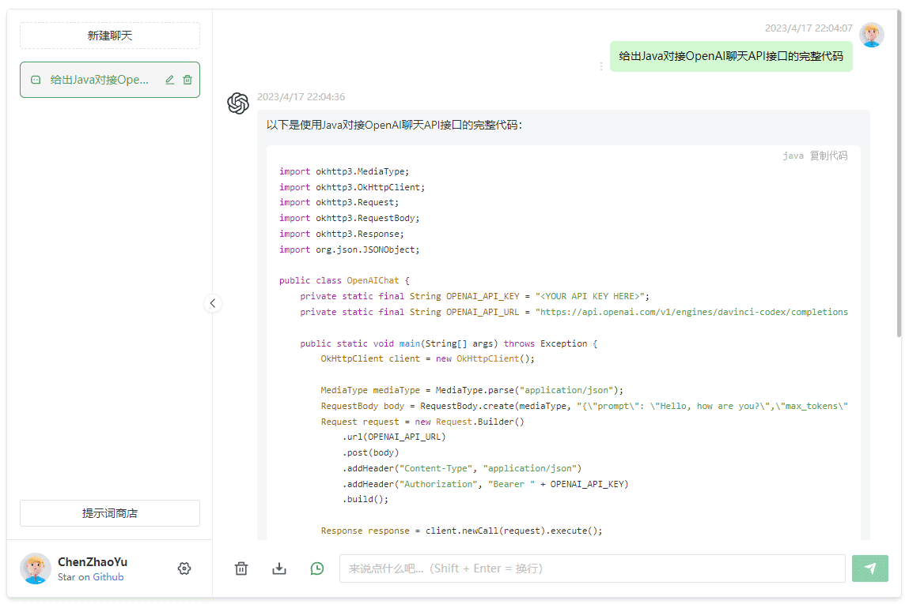

# ChatGPT-Web-Java

[简体中文](https://github.com/suimz/ChatGPT-Web-Java/blob/master/README.md) | English

> Note: The following content is translated using GPT

A Java version server project, using Java + Spring technology stack, adapted to the front-end project interface implementation of [Chanzhaoyu/chatgpt-web][ChatGPT-Web], open-source for personal reference and learning.

------------------------------



## Quick start

```
docker run \
  -it -d \
  --name chatgpt-web-java \
  -p 8080:8080 \
  hubsuimz/chatgpt-web-java:0.0.2-full \
  --app.openai-api-key=YourApiKey
```

Access: http://yourDomainOrIP:8080

> The `version number-full` TAG image integrates the front-end page of [ChatGPT-Web] and can be accessed and used directly.

## Introduction

The following description is excerpted from [ChatGPT-Web]. This project is based on the API interaction process of this project. Thank [@Chanzhaoyu](https://github.com/Chanzhaoyu) for providing the high-quality project.

支持双模型,提供了两种非官方 `ChatGPT API` 方法

| 方式                                          | 免费？ | 可靠性   | 质量   |
|---------------------------------------------|-----|-------|------|
| `ChatGPTAPI(gpt-3.5-turbo-0301)`            | 否   | 可靠    | 相对较笨 |
| `ChatGPTUnofficialProxyAPI(网页 accessToken)` | 是   | 相对不可靠 | 聪明   |

对比:
1. `ChatGPTAPI` 使用 `gpt-3.5-turbo` 通过 `OpenAI` 官方 `API` 调用 `ChatGPT`。
2. `ChatGPTUnofficialProxyAPI` 使用非官方代理服务器访问 `ChatGPT` 的后端`API`,绕过`Cloudflare`（依赖于第三方服务器,并且有速率限制）。

警告:
1. 你应该首先使用 `API` 方式。
2. 使用 `API` 时,如果网络不通,那是国内被墙了,你需要自建代理,绝对不要使用别人的公开代理,那是危险的。
3. 使用 `accessToken` 方式时反向代理将向第三方暴露您的访问令牌,这样做应该不会产生任何不良影响,但在使用这种方法之前请考虑风险。
4. 使用 `accessToken` 时,不管你是国内还是国外的机器,都会使用代理。默认代理为 [@acheong08](https://github.com/acheong08) 大佬的 `https://bypass.churchless.tech/api/conversation`,这不是后门也不是监听,除非你有能力自己翻过 `CF` 验证,用前请知悉。
5. 把项目发布到公共网络时,你应该设置 `app.auth-secret-key` 参数添加你的密码访问权限。

## Version

This is a version comparison table based on [ChatGPT-Web] at the time of the development of the server-side code. It is not guaranteed that the current project is compatible with [ChatGPT-Web] versions higher than the following records.

| ChatGPT-Web-Java | ChatGPT-Web |
|------------------|-------------|
| 0.0.2            | 2.11.0      |
| 0.0.1            | 2.10.9      |

## Project dependencies

- JDK 11+ (not tested on 8)
- Gradle 7+
- Spring-Boot 2.7.10
- OpenAI-Java 0.12.0 Project address: [https://github.com/TheoKanning/openai-java](https://github.com/TheoKanning/openai-java)

## Deployment

### Using Docker

#### Method 1

```
docker run \
  -it -d \
  --name chatgpt-web-java \
  -p 8081:8080 \
  hubsuimz/chatgpt-web-java \
  --app.openai-api-key=YourApiKey
```

#### Method 2

```
docker run \
  -it -d \
  --name chatgpt-web-java \
  -p 8080:8080 \
  -v ~/chatgpt-web-java:/app/config \
  hubsuimz/chatgpt-web-java
```

The second method will fail to start for the first time. You need to modify the configuration file `~/chatgpt-web-java/application-app.properties` mapped out above and other parameters such as `app.openai-api-key`, and then restart the container:

```
docker restart chatgpt-web-java
```

### Manual build

This is a standard `Spring Boot` project. You must be very familiar with this framework!

You can use your own familiar IDEA for build or execute the compile script in the root path of the source code:

```
./gradlew bootJar
```

The location of the compiled `Jar`: `project root path/build/libs/app.jar`

I won't tell you how to run it, I believe you are smart enough to know to use the `java -jar` command.

**Other:**

If you want to package [ChatGPT-Web] into the project, you can do the following:

1. Package the front-end project of [ChatGPT-Web], how to package please refer to: [Here](https://github.com/Chanzhaoyu/chatgpt-web#%E5%89%8D%E7%AB%AF%E7%BD%91%E9%A1%B5-1)  .
2. Copy all files in the `dist` directory to the `src/main/resources/static` directory.

## Args

| Parameter                          | Required                                                 | Comments                                                                                                                                                                        |
|------------------------------------|----------------------------------------------------------|---------------------------------------------------------------------------------------------------------------------------------------------------------------------------------|
| `app.auth-secret-key`              | Optional                                                 | [ChatGPT-Web] access key, when you deploy to the public network, it is recommended to configure                                                                                 |
| `app.max-request-per-hour`         | Optional                                                 | Maximum number of chat requests per hour per IP, optional, default to unlimited.                                                                                                |
| `app.api-timeout-ms`               | Optional, default:120000                                 | API request timeout duration, in milliseconds.                                                                                                                                  |
| `app.openai-api-key`               | -                                                        | The apiKey required for using the OpenAI API. [(Obtain apiKey)](https://platform.openai.com/overview)                                                                           |
| `app.openai-access-token`          | -                                                        | The accessToken required for using the Web API. [(Obtain accessToken)](https://chat.openai.com/api/auth/session)                                                                |
| `app.openai-sensitive-id`          | Optional                                                 | Used to query the account balance. [(Obtain sensitiveId)](https://platform.openai.com/account/usage) by retrieving the results of the `login` interface request in the console. |
| `app.openai-api-base-url`          | Optional,`api-key` can be used                           | `API` interface address                                                                                                                                                         |
| `app.openai-api-mode`              | Optional,`api-key` can be used, default: `gpt-3.5-turbo` | `API` model                                                                                                                                                                     |
| `app.openai-reverse-api-proxy-url` | Optional,`access-token` can be used                      | `Web API` proxy address. [Detail](https://github.com/transitive-bullshit/chatgpt-api#reverse-proxy)                                                                             |
| `app.socks-proxy.host`             | Optional                                                 | Socks proxy address                                                                                                                                                             |
| `app.socks-proxy.port`             | Optional                                                 | Socks proxy port                                                                                                                                                                |
| `app.socks-proxy.username`         | Optional                                                 | Socks proxy username                                                                                                                                                            |
| `app.socks-proxy.password`         | Optional                                                 | Socks proxy password                                                                                                                                                            |
| `app.http-proxy.host`              | Optional                                                 | HTTP proxy address                                                                                                                                                              |
| `app.http-proxy.port`              | Optional                                                 | HTTP proxy port                                                                                                                                                                 |

For details, please refer to: `src/main/resources/application-app.properties`

## License

[Apache License 2.0](https://github.com/suimz/ChatGPT-Web-Java/blob/master/LICENSE)

[ChatGPT-Web]: https://github.com/Chanzhaoyu/chatgpt-web